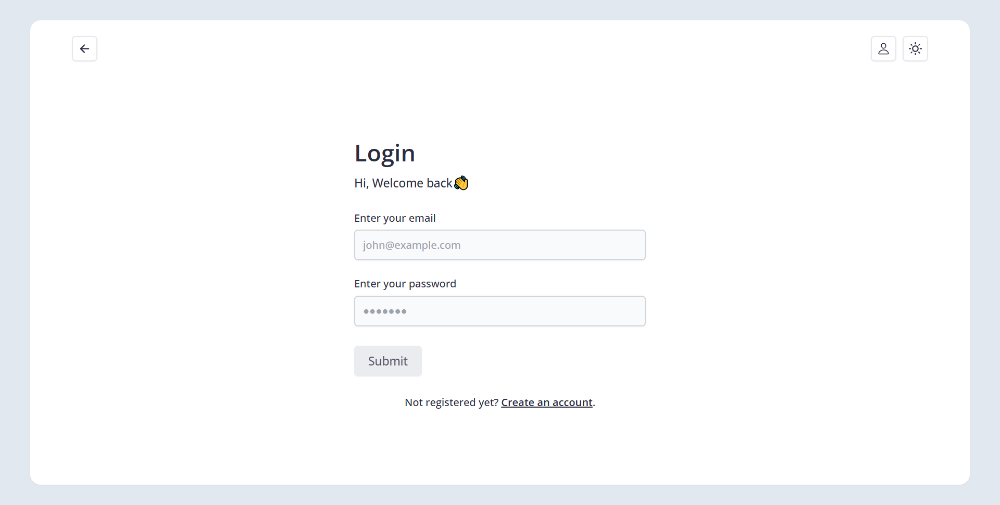
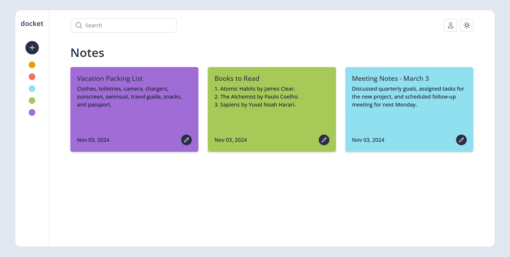

# Docket Frontend

A responsive and user-friendly notes management web application built with React.js, TailwindCSS, Redux, and React
Router DOM. Docket allows users to create, view, update, and delete notes, all while ensuring secure access through user
authentication. This application seamlessly integrates with the Docket backend API for robust data handling and user
management.

## Table of Contents

- [Features](#features)
- [Technologies Used](#technologies-used)
- [Project Links](#project-links)

## Features

- **User Authentication**: Sign up, log in, and log out functionalities with secure session handling.
- **Responsive Design**: Adaptive layout optimized for both desktop and mobile devices.
- **Create Notes**: Add notes with a title and content, stored securely in the backend.
- **Read Notes**: View a list of all notes and read individual notes with a clean, intuitive interface.
- **Update Notes**: Edit note titles and content with instant feedback and autosave functionality.
- **Delete Notes**: Remove notes from your account with confirmation to prevent accidental deletion.

## Technologies Used

- **[React.js](https://reactjs.org/)**: A JavaScript library for building dynamic user interfaces.
- **[TailwindCSS](https://tailwindcss.com/)**: A utility-first CSS framework for responsive, custom styling.
- **[Redux](https://redux.js.org/)**: Manages global state for consistent data flow across the app.
- **[React Router DOM](https://reactrouter.com/)**: Enables declarative routing to enhance navigation experience.

## Screenshots

_Login screen with a simple form_

_Dashboard showing a list of notes with options to view & edit note_

## Project Links

- **Source Code**: [Frontend Repository](https://github.com/sam4web/docket-frontend)
- **Live Preview**: [Docket Live](https://projectdocket.netlify.app/)
- **Backend Code**: [Backend Repository](https://github.com/sam4web/docket-backend)
